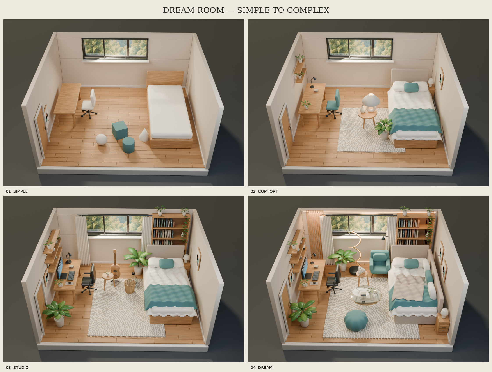

# Dream Room — Blender reconstruction and agent research

Four editable room scenes reconstructed with Codex from a single reference board, with a static browser viewer and a research review of Blender-agent failure points.

**[Explore the interactive rooms](https://jivraj-18.github.io/dream-room-blender/)** · **[Modeling notes](dream_rooms/README.md)** · **[Research report](research/blender-agents-2026-10-07/REPORT.md)**



## The rooms

| Room | Blender source | Browser model |
|---|---|---|
| Simple | [01_simple.blend](dream_rooms/scenes/01_simple.blend) | [01_simple.glb](dream_rooms/viewer/models/01_simple.glb) |
| Comfort | [02_comfort.blend](dream_rooms/scenes/02_comfort.blend) | [02_comfort.glb](dream_rooms/viewer/models/02_comfort.glb) |
| Studio | [03_studio.blend](dream_rooms/scenes/03_studio.blend) | [03_studio.glb](dream_rooms/viewer/models/03_studio.glb) |
| Dream | [04_dream.blend](dream_rooms/scenes/04_dream.blend) | [04_dream.glb](dream_rooms/viewer/models/04_dream.glb) |

The viewer supports orbit, zoom, pan, room selection, walkthrough navigation, object inspection, side-wall visibility and GLB download. Its Three.js modules and model textures are included locally, so it requires no backend or API token.

These are interpreted reconstructions, not recovered source geometry. Dimensions and hidden geometry are inferred. Interiors are modeled; window greenery is a flat backdrop sampled from the supplied reference. Browser lighting and material detail differ from the Cycles still renders. Walkthrough collision uses selected furniture bounds rather than a complete physics simulation.

## Run the viewer locally

```bash
python3 -m http.server 8765 --directory dream_rooms/viewer
```

Open http://localhost:8765/. GitHub Pages serves the repository root, whose `index.html` redirects into the same viewer.

## Rebuild the models

Linux x64 setup, using the free official Blender 5.2.2 LTS archive:

```bash
bash tools/install_blender.sh
./blender dream_rooms/scenes/04_dream.blend
```

The installer checks a pinned official SHA-256 and keeps Blender under `.tools/`. Other platforms can install Blender separately and substitute their executable for `./blender`.

```bash
./blender --background --factory-startup --python-exit-code 1 \
  --python dream_rooms/build_rooms.py -- --room 4

./blender --background dream_rooms/scenes/04_dream.blend \
  --python-exit-code 1 --python dream_rooms/export_browser.py -- --room 4
```

See [the room documentation](dream_rooms/README.md) for all four room numbers, render settings, diagnostics and assumptions.

## Research and evidence

The [research report](research/blender-agents-2026-10-07/REPORT.md) covers prior implementations, visual-versus-structural failures, observation strategies, local-model options, cost accounting and a proposed benchmark. Its [42-source index](research/blender-agents-2026-10-07/sources.csv) links to the reviewed material. Reference API rate rows are historical research data, not a paid deployment requirement.

[Artifact verification](dream_rooms/evidence/artifact-verification.json) records file integrity, model sizes and browser checks. [The Dream side view](dream_rooms/evidence/04_dream_side.png) shows additional geometry beyond the primary render.

This was one Codex session with visual self-review. No independent/repeated modeling benchmark, numeric reconstruction accuracy or production-readiness score is claimed. No paid asset or additional model-generation API was used; existing Codex-session consumption was not reconciled to a monetary bill.

Downloaded Blender binaries, caches, backup `.blend1` files and raw third-party research snapshots are excluded from Git. The source index and snapshot manifest preserve research provenance; raw snapshots referenced in the original local notes are not distributed here. The original workspace retains them.

Three.js 0.180.0 is included with its [MIT license](dream_rooms/viewer/vendor/THREE-LICENSE.txt). The supplied reference image is retained as the input to this study; no rights to that image are asserted beyond its use in the project.
