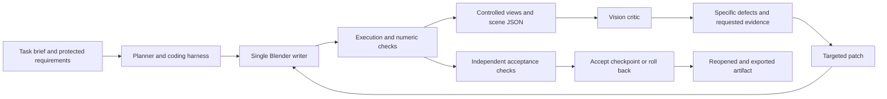

# Blender agents: prior work, failure boundaries, and a cost-aware research design

Research date: 7 October 2026. This is a literature and implementation review, followed by a proposed experiment. No agent modeling benchmark or paid model calls were performed. After the review, the user requested Blender installation; a separate installation smoke test created, CPU-rendered and reopened a simple scene successfully.

**Binding constraint: no payments.** The proposed implementation uses free software, downloaded local models, and existing hardware only. No paid API, subscription, credits, commercial plug-in, asset purchase or rented GPU is required. Dollar figures below describe published work or hypothetical API-equivalent accounting; they are not a spending plan. The local architecture and revised experiment budgets below supersede any cloud-based baseline.

**Main finding.** Your proposed coding-agent → Blender → rendered evidence → vision critic → correction loop already exists in several forms. It can produce useful editable props, procedural assets, assembled environments, and some animated scenes. Existing evidence does not establish reliable autonomous production across arbitrary modeling tasks. The promising research question is how to make correction dependable and economical, and how to recognize when it has failed.

**1. What already exists, and what to reuse**

| Existing work | What it already implements | Reuse decision and evidence limits |
|---|---|---|
| [BlenderAlchemy, ECCV 2024](https://arxiv.org/abs/2404.17672), [code](https://github.com/ianhuang0630/BlenderAlchemyOfficial) | A visual edit generator and state evaluator search over candidate Blender program edits; covers procedural material, geometry, and lighting changes. Can use generated reference images. | Foundational baseline for iterative editing and candidate selection. Its examples concern constrained editing, not a universal autonomous artist. README pins an old Infinigen commit, so reproduce in an isolated environment. |
| [BlenderGym, CVPR 2025](https://arxiv.org/html/2504.01786v1), [code/data](https://github.com/richard-guyunqi/BlenderGym-Open) | 245 authored start/goal pairs across placement, lighting, materials, procedural geometry, and blend shapes; generator/verifier experiments and image/geometry metrics. | Reuse tasks and evaluation rather than inventing all fixtures. It already uses iterative candidates and multiple views: describing it as only one-shot or only single-camera would be incorrect. |
| [LL3M, 2025](https://arxiv.org/html/2508.08228v1), [repository](https://github.com/threedle/ll3m) | Planning, documentation retrieval, coding, debugging, visual critique, and targeted refinement of editable Blender assets. | Very close conceptual match. The paper explicitly shows automatic refinement leaving disconnected handles and incorrect orientation. The repository now says its hosted server is discontinued; do not assume the published demo is runnable today. |
| [VIGA / BlenderBench, January 2026](https://arxiv.org/html/2601.11109v1), [code](https://github.com/Fugtemypt123/VIGA) | Write–execute–render–compare–revise; alternating generator/verifier roles; persistent plans and render history; scene queries, camera exploration, isolation, and timeline inspection. BlenderBench has 30 tasks. | Closest research implementation to adapt. Reported relative improvements, including 124.70% on BlenderBench, concern its benchmark metrics, not a 124.70% success rate. Its MIT code can inform a local implementation, but its documented default setup asks for model-service keys. Replace those adapters and disable paid generation tools; this is not a verified free turnkey reproduction. |
| [EZBlender, January 2026](https://arxiv.org/html/2601.07143v1) | Plan-and-ReAct decomposition with localized self-refinement, studying responsiveness and token expenditure. | Reuse its local-repair hypothesis. Its reported speed and token improvements are task/protocol-specific; they do not price an arbitrary complete asset. |
| [SimWorlds, July 2026](https://arxiv.org/html/2607.01766v1), [project](https://dynsimworlds.github.io/) | Staged planner/coder/reviewer workflow, deterministic scene protocol, runtime-state inspection, bounded retries and checkpoints for dynamic scenes. Introduces 4DBuildBench. | Strong precedent for geometry-plus-mechanism verification. The paper acknowledges unreliable perceptual judgments and text-only conditioning. I did not establish a usable public implementation from its project page; similarly named GitHub repositories were not verified as this work. |
| [Blender-VideoBench / BVB, September 2026](https://arxiv.org/html/2609.15478v1) | Shared lightweight Blender harness, asset-free video reconstruction, cost limits, and separate perceptual and semantic evaluation. | Reuse its controlled-budget methodology and separation of appearance from factual retention. This is a recent preprint, not a complete production-asset benchmark. |
| [MCP for Blender, formerly BlenderMCP](https://github.com/ahujasid/mcp-for-blender) | Blender execution and scene inspection; multi-angle, wireframe, X-ray, animation-strip and rendered evidence; retrieval and 3D-generation integrations. Configurations for Claude Code, Codex and Antigravity. | Reuse the bridge and diagnostic tools. MCP makes actions accessible; it does not itself establish modeling competence or reliable correction. Pin a commit and matching add-on/server versions. |
| [Blender Agent Studio](https://github.com/ifBars/blender-agent-studio), [results](https://ifbars.github.io/blender-agent-studio/results/) | Specialist workflows, scene representation extraction, topology/motion inspection, reference-camera fitting, evidence rendering, Claude/Codex runners and trace accounting. Its methodology also describes an opt-in critic/repair/recheck loop. | Strong practical starting point. October 2 pilot: technical gates passed in 4/8 no-plugin and 7/8 plugin submissions. One generation per condition; generation order was not counterbalanced; this measured skills/scripts rather than MCP's effect. Directional evidence, not a general success rate. |
| [Photo-to-Blender quality/cost pilot, October 2026](https://kaloyan.blog/ai-models-rebuild-a-photo-in-blender), [Reddit discussion](https://www.reddit.com/r/LLMDevs/comments/1wvqju6/evaluating_14_llms_as_a_visual_coding_agent/) | Deterministic re-rendering and image/mesh checks, a second camera, failure-inclusive scores, and per-attempt costs. The article currently contains sixteen models; the earlier Reddit title says fourteen. | Another very close match to your proposed datastory. Three photos, one run per model/photo, evolving briefs and mixed harnesses make this preliminary. Some costs are subscription usage valued at API rates; GPU contention affects times. |
| [BlenderLLM / CADBench, 2024](https://github.com/FreedomIntelligence/BlenderLLM) | Fine-tuned text-to-Blender script generation with self-improvement in training. | A different kind of self-improvement. Repository limitations include basic modeling, no multimodal inputs, and no multi-turn dialogue. Useful baseline/data, not a substitute for the interactive vision loop. |

Avoid claiming that self-correcting Blender agents, multi-agent visual critique, active camera inspection, deterministic geometry checks, or quality-versus-cost analysis are new inventions. All have precedents. A potentially useful contribution is a reproducible failure atlas combining current native harnesses, controlled observation strategies, critic accuracy, downstream usability, and complete cost accounting. This review does not establish exhaustive novelty.

**2. What the results actually support**

BVB evaluates 51 configurations across 288 indoor videos under a common $3 per-scene generation ceiling. Its leading configuration reports 88.6 perceptual similarity and 53.7% retention of questions the judge answers correctly on the source. The judge itself has 35.6% source accuracy, so retention is conditional, not a percentage of all scene facts. Both axes assess rendered video, not underlying geometry. Appendix K reports generation costs excluding evaluation: Astra $1.258, Sol-xhigh $0.778, and GLM-5.3-Flash-xhigh $0.024 per scene. These are task-specific means, not quotes for your workload. [Paper and cost frontier](https://arxiv.org/html/2609.15478v1).

The photo-to-Blender pilot reports mean score/cost per attempt of Astra 66/$3.91, Sol 6.1 61/$0.36, Opus 5.5 60/$1.19, and Sonnet 5.5 56/$0.50. Scores are a calibrated comparison scale, not percentages of geometry recovered. The newest three used native CLIs and a later brief; an Astra check under that setup scored 63 rather than 66. This cannot rank the harnesses independently. [Author's experiment](https://kaloyan.blog/ai-models-rebuild-a-photo-in-blender).

BlenderGym identifies subtle visual differences missed by generators, non-executable scripts, executable but irrelevant edits, and verifier preference/order biases. Its older tested models substantially trail human users. These are documented failure mechanisms to retest with current models, not proof that the same numerical gap persists today. [Failure analysis](https://arxiv.org/html/2504.01786v1).

**3. How much modeling looks achievable**

The following is an informed expectation for experiment selection, not measured performance of your system. Difficulty depends on representation, starting assets, task constraints and quality requirements.

| Work class | Practical expectation | Where to test the boundary |
|---|---|---|
| Repeated geometry, primitives, curves, furniture, modular architecture | Most promising for code-based automation, especially with parameterized constructors | Exact counts, joins, hidden surfaces, dimensions and later edits |
| Low-poly/stylized props and scene blockouts | Useful drafts and potentially usable simple assets | Coherent style, polygon budgets, tiny details and close-up inspection |
| Existing-scene placement, material and lighting edits | Good bounded research targets with known start states | Contact, coordinate frames, roughness/lighting ambiguity and preserving other objects |
| Whole environments | Plausible with hierarchy, reusable assets and staged construction | Accumulated layout errors, naming/state confusion, export contamination and resource growth |
| Organic objects | Hybrid image-to-3D generation plus agent cleanup is promising | Shape control, semantic part separation, deformation topology and repeatable editing |
| Articulated rigid mechanisms | Possible with explicit joints and deterministic tests | Correct pivots, travel limits, collision, constraints and motion between sampled frames |
| Characters, faces, hands, clothing and production rigs | High-risk autonomous targets; start from known meshes/rigs | Anatomy, likeness, edge flow, skin weights, pose deformation and identity preservation |
| UVs, retopology, LODs and engine exports | Can automate bounded operations and validation | Intentional seams, texture density, animation suitability and format-specific material loss |
| Physical/mechanical accuracy | A render provides insufficient evidence | Dimensions, clearance, structural intent and simulation assumptions; supply numeric constraints and relevant tools |

For complex organic assets, compare code-only creation with a hybrid route using a specialized 3D generator. [Microsoft TRELLIS.2](https://github.com/microsoft/TRELLIS.2) is one available component; generation quality does not by itself certify a rig, editable part structure or downstream requirements. An existing practitioner already combines Claude Code, Blender MCP, TRELLIS.2 and ComfyUI with artist/QA roles. [Reddit workflow](https://www.reddit.com/r/TopologyAI/comments/1ujsb2l/test_to_3d_scene_gen_with_blender_claude_code/).

**4. Ways to show 3D to a vision critic**

For ordinary image-input VLMs, the bridge is rendered observations plus structured scene information. A .blend file may be accessible to the coding agent through tools even though the vision model cannot interpret it directly. Specialized 3D-input research models also exist; the limitation is specific to the model/interface chosen.

These are proposed ablation conditions:

| Observation | Useful for | Blind spot / cost trade-off |
|---|---|---|
| One beauty render | Appearance, composition and rough prompt alignment | Hidden sides, topology and camera-dependent tricks remain invisible |
| Fixed front/back/left/right/top/bottom plus perspective views | Shape, count, proportions and consistency across viewpoints | More image tokens and renders; contact sheets may shrink important details |
| Orthographic clay renders and silhouettes | Separating geometry from lighting/material distractions | Reduced material evidence; thin or internal defects may still be hidden |
| Wireframe, normals, depth and object-ID passes | Localizing surface, orientation and object-identity problems | Non-natural imagery may confuse the critic; pair with explanation and normal renders |
| Isolated-part crops, exploded views and cross-sections | Joins, interior clearance and small components | Isolation changes context; keep a whole-scene view and explicit transforms |
| Turntable frames | Consistent visual inspection around an object | Video modality and frame sampling vary; a uniformly sampled orbit may miss a defect |
| Active camera selection | Requesting the view most likely to resolve uncertainty | Already demonstrated in VIGA; evaluate whether the extra calls earn their cost |
| Images plus a compact scene JSON | World-space bounds, transforms, hierarchy, materials, modifiers, rigs and numeric checks | Extraction must reflect evaluated geometry; raw vertex dumps overwhelm context |
| Motion frames plus runtime traces | Contact, articulation and event order | Frames alone can miss transient failures; include contacts, joint values and constraints |

My starting choice is a labeled multiview clay sheet, a beauty view, and compact numeric scene data; request detailed crops only when needed. This is a hypothesis to test. Six views are a starting convention, not an optimal number established by the literature.

**5. Failure taxonomy and present-day mitigation**

The mitigations below are engineering proposals. They reduce specific failure opportunities; none proves the whole system is solved.

| Layer | Failure | Proposed mitigation | Residual limit |
|---|---|---|---|
| Blender/API | Context-dependent operators, wrong selection, unsupported node sockets | Pin Blender; retrieve matching docs; prefer direct data/BMesh where appropriate; explicit context and execution checks | API/version changes and difficult operations still need debugging |
| Bridge | Connected socket but no execution; incompatible message framing; partial JSON; timeouts | Probe a real round-trip; match add-on/server; request IDs, bounded errors and task completion polling | Transport failure must be distinguished from model failure |
| Agent perception | Missed rear detail, count, contact or thin gap | Multiview evidence, crops and numeric part/contact tests | A single reference cannot reveal unknowable hidden geometry |
| Inverse graphics | Wrong camera compensated by wrong shape; lighting mistaken for material | Calibrate camera first; inspect neutral passes; fit one parameter family at a time | Multiple 3D scenes can explain the same image |
| Geometry | Floating parts, degeneracy, inconsistent normals, unintended intersections | Mesh-health checks, evaluated bounds, specified contact/clearance constraints | Not every open surface or intersection is a defect; checks must follow task intent |
| Critic | Missed errors, invented errors, position bias, self-preference | Independent critic, shuffled/counterbalanced comparisons, known-good/bad calibration, abstention | Another model can share the same blind spot |
| Correction | Fix oscillation, fixing one view while breaking another, deleting details | Local patches, persistent IDs, protected invariants, checkpoint and same-evidence recheck | Bounded search may stop before a feasible solution is found |
| Multi-agent coordination | Several agents mutate the same scene or work from stale state | Single scene writer; immutable snapshots for critics; isolated candidate processes | Coordination adds latency and context cost |
| Animation/mechanics | Correct-looking frame but wrong joint motion, rig or contact | Pose suites, temporal sampling, runtime-state audits and task-specific simulation checks | Sparse samples do not certify continuous motion |
| Delivery | Export includes stage floor, missing textures, wrong units, unusable file | Export only asset collections; reopen .blend and round-trip intended export in fresh processes | Renderability does not establish production readiness |
| Budget | Endless critique/render loops, repeated large context, silent quota exhaustion | Cheap checks first; stable prefixes; compact JSON; budget/iteration caps; best-valid checkpoint | Subscription usage may not map exactly to dollars |

Blender's own documentation explains [operator context limitations](https://docs.blender.org/api/current/info_gotchas_operators.html) and [unsafe Python threading](https://docs.blender.org/api/current/info_gotchas_threading.html). Parallel agents should work on isolated candidates; serialize Blender scene mutations through an appropriate execution path. This does not prevent parallel model reasoning or rendering in separate processes.

GitHub reports show actual integration failures: [issue 219](https://github.com/ahujasid/mcp-for-blender/issues/219) documents incomplete JSON and a user's mismatched-bridge workaround; [issue 299](https://github.com/ahujasid/mcp-for-blender/issues/299) reports successful connection but no command execution after handler-registration failure. Both were closed when checked; closure alone does not establish a particular fix for every environment.

Reddit provides useful task leads, not prevalence estimates. Users report [positioning loops](https://www.reddit.com/r/blender/comments/1v381xt/help_with_blender_mcp_for_creating_youtube_shorts/) and [a character damaged during a requested sitting pose](https://www.reddit.com/r/blender/comments/1vvekml/i_think_the_blender_mcp_ruined_my_character_model/). A contrasting [hospital-corridor demo](https://www.reddit.com/r/OpenAI/comments/1wem6s7/chatgpt_blender_mcp_built_this_from_scratch/) reports about 45 minutes with staged human direction. I read post bodies/comments through rdt; I did not inspect the video or audit the delivered geometry, so this is a reported workflow, not independently verified output quality.

**6. A correction architecture to evaluate**

The critic should return object IDs, violated requirement IDs, evidence views, severity, uncertainty, and a proposed causal change. Example: “lamp_hinge_02 is 18 mm outside the specified joint contact; shown in side view; move hinge along its local axis; preserve base dimensions.” Avoid feedback like “make it more realistic.”

Separate execution repair from visual repair. A failed script first goes back with the actual error. A renderable candidate gets scene validation and visual critique. Accept a patch only if the targeted defect improves and protected requirements remain valid. Save code, scene, views and cost at every accepted checkpoint. Stop on acceptance, budget exhaustion, repeated non-improvement or unresolved uncertainty; return the best validated checkpoint and its remaining defects.

Use roles before adding concurrent agents. A planner, coder and critic can be phases in one orchestrator. Compare that with a separate critic and small candidate search before spending on a larger team. One shared scene should have one writer. An independent final evaluator must not be the critic whose feedback optimized the candidate.

**7. Harnesses and cost accounting**

Claude Code, Codex and Antigravity are harnesses, not interchangeable names for Claude, GPT and Gemini. Model, harness, tool interface, effort, prompt, assets, rendering environment and observation strategy can all change results. Run a native-product comparison for practical utility; use a separate common-harness model comparison for causal model claims. Where the same model is supported across products, a matched-model harness test is useful, but record endpoint/routing differences. Unsupported combinations must remain missing cells.

Under the no-payment constraint, the practical comparison is the harnesses using local open-weight models, not their paid flagship backends. Official documentation establishes these routes:

- **Claude Code + local Ollama:** Ollama documents its Anthropic-compatible endpoint, local model selection, tools and vision with compatible models. This runs the Claude Code harness with a different model; it does not run Claude weights locally. [Ollama integration](https://docs.ollama.com/integrations/claude-code).
- **Codex CLI + local Ollama:** OpenAI documents `--oss` and `--local-provider ollama`. Use an explicit local model, rather than a cloud tag. Tool and image compatibility still need a smoke test for the chosen model. [Official OpenAI configuration](https://learn.chatgpt.com/docs/config-file/config-advanced), [Ollama integration](https://docs.ollama.com/integrations/codex).
- **Antigravity SDK + local server:** Google's documentation explicitly supports local models without an API key or internet connection through `LocalOpenAIAgentConfig` or LiteRT. This supports an Antigravity-family local experiment; it does not establish that the cloud IDE has identical behavior. [Local-model documentation](https://antigravity.google/docs/sdk/local-models).

Documented integration is not a completed local validation. If a model fails a tool protocol or a harness needs an unavailable paid route, record that compatibility failure and exclude the route. Do not silently switch to a billed backend. Local endpoints must be selected explicitly; model names with cloud suffixes and remote fallback routes are excluded.

| Harness | Documented collection route | Important limitation |
|---|---|---|
| Claude Code | Streamed/SDK result usage; OpenTelemetry token, cost and tool events; `/usage` session estimate; reconcile with Console/provider billing | Local reported dollar values can be list-price estimates. Per-agent and detailed thinking fields must be checked on the actual installed version/provider. [Cost docs](https://code.claude.com/docs/en/costs), [monitoring](https://code.claude.com/docs/en/monitoring-usage). |
| Codex | App-server `thread/tokenUsage/updated` and tool item events; API usage where applicable; plan dashboard/credits for subscription runs | Usage fields can be best-effort and cache-write detail may be absent on some routes. Missing fields are unknown, not zero. [App server](https://learn.chatgpt.com/docs/app-server), [usage accounting](https://developers.openai.com/api/docs/guides/agents-api/observability). |
| Antigravity | Current CLI `--output-format stream-json` provides tool steps and usage, including input, output, thinking and cache-read counts; SDK exposes usage metadata | Token telemetry does not make included quota into a per-task cash bill. Personal-plan overages and organization billing differ; verify coverage of subagents and retries experimentally. [Headless CLI](https://www.antigravity.google/docs/cli/headless/), [SDK hooks](https://antigravity.google/docs/sdk/lifecycle), [plans](https://antigravity.google/docs/plans). |

Do not estimate thinking cost from displayed reasoning text. OpenAI bills reasoning as output; Claude's API documents `usage.output_tokens_details.thinking_tokens` as an output subset; Antigravity's documented example likewise has thinking within its output total. Preserve raw provider fields and normalize once, without adding thinking twice. A summarized explanation is not the full internal process. [OpenAI accounting](https://developers.openai.com/api/docs/guides/agents-api/observability), [Claude thinking](https://platform.claude.com/docs/en/build-with-claude/thinking-steering-and-cost), [Antigravity usage example](https://www.antigravity.google/docs/cli/headless/).

For ordinary local/client tools there is no universal “MCP fee per call.” Costs include model processing of tool definitions, call arguments and results; Blender CPU/GPU execution; and any API invoked by the tool. Hosted/provider tools can have separate prices. A single asset-generation MCP call may hide paid third-party calls. Count calls and execution costs separately from tokens, and attribute model spend to the stage without charging it twice. [Claude tool pricing](https://platform.claude.com/docs/en/about-claude/pricing), [OpenAI pricing](https://developers.openai.com/api/docs/pricing).

Keep four separate cost numbers: actual metered charges, API-equivalent estimate, allocated subscription cost, and full production/evaluation cost. Included/free quota is not evidence of zero resource use. Log human intervention minutes separately and show monetized labor only with an explicit rate assumption.

For our local runs, service charges are zero by design, allocated paid-subscription cost is not applicable, and compute resources remain measurable: input/output tokens, cached prompt work where reported, time, peak RAM/VRAM, render time and energy if a reliable sensor is available. Ollama documents `prompt_eval_count`, `eval_count`, durations and cached counts; preserve absent fields as unknown. The installed version must be probed because current docs can exceed its capabilities. A separate thinking-token count may not be exposed; do not derive an exact one from a summary. [Ollama usage metrics](https://docs.ollama.com/api/usage).

Current indicative USD rates per million tokens, standard service and short-context where applicable:

| Model route | Fresh input | Cache read | Cache write | Output, including reasoning |
|---|---:|---:|---:|---:|
| OpenAI API: GPT-6.1 Sol | 2.00 | 0.10 | 2.50 | 10.00 |
| OpenAI API: GPT-6 Astra | 10.00 | 1.00 | 12.50 | 50.00 |
| Claude API: Sonnet 5.5 | 2.00 | 0.20 | 2.50, 5-minute / 4.00, 1-hour | 10.00 |
| Claude API: Opus 5.5 | 4.00 | 0.20 | 5.00, 5-minute / 8.00, 1-hour | 20.00 |
| Gemini Developer API: 3.8 Flash | 0.75 | 0.075 | Separate caching/storage rules | 3.75 |

Sources: [OpenAI API rates](https://developers.openai.com/api/docs/pricing), [Claude API rates](https://platform.claude.com/docs/en/about-claude/pricing), [Gemini API rates](https://ai.google.dev/gemini-api/docs/pricing). Gemini figures are promotional through 31 December 2026 and include additional cache-storage pricing. These Gemini Developer API rates are not asserted to be Antigravity's invoice rates. Region, long context, speed tiers, discounts and billing route can alter charges. Codex plan credit billing has its own rate card and no separate cache-write charge. [Codex/ChatGPT plan pricing](https://learn.chatgpt.com/docs/pricing).

For disjoint billable categories, estimate:

`model cost = (fresh input × fresh rate + cache-read × read rate + cache-write × write rate + total output × output rate) / 1,000,000`

Provider adapters must define whether reported input already includes reads/writes. For illustration only, 100k fresh input, 200k cache reads, 20k cache writes and 20k total output cost $0.47 on Sol, $2.45 on Astra, $0.49 on Sonnet and $0.94 on Opus using 5-minute Claude writes. If 12k of output is thinking, it is already within the 20k. Equal artificial token counts do not imply equal performance or equal tokenization. Images are input usage, not an extra duplicate bill.

`full task cost = creator + planner/critic/subagents + retries/compaction + third-party tools/assets + Blender compute + evaluation + explicitly allocated overhead`

`cost per accepted asset = total campaign production spend, including failed attempts / number of accepted assets`

If there are no accepted assets, report that ratio as undefined and show spend. Report evaluation expense alongside production expense, rather than hiding it in a model's supposed generation price.

**8. Proposed benchmark and datastory**

Phase 0 starts with one minimal free end-to-end loop on the available machine, then a twelve-run feasibility check if hardware allows: two tasks × three local harness routes × two repeats. Test image delivery, real Blender round-trips, checkpointing, exported artifacts, usage fields, subagent coverage and cache behavior before committing to a larger sweep. No such runs have been performed here. The Antigravity SDK route and CLI routes are explicitly different product surfaces.

Phase 1 is twelve tasks × three locally validated harness configurations × three workflow arms × three independent repeats = 324 runs. This is an expansion target, not a requirement for a first CPU pilot. Use the accompanying `pilot_tasks.csv` as authored specifications, not already-built fixtures. Prefer the same local coder and external local vision critic across harnesses to isolate the harness; only compare different models in a separate lane. Independently repeat runs even when runtimes cannot guarantee a seed. Counterbalance order and avoid shared compute contention during latency measurement.

| Arm | Defined workflow | Interpretation |
|---|---|---|
| A | Coding plus runtime/numeric error feedback, no vision correction | Baseline automation |
| B | A plus fixed multiview visual critique and bounded local repair | Benefit of this visual-correction package |
| C | B plus active diagnostic views, compact scene data and task-specific structural gates | Benefit of the enhanced package, not attribution to any single ingredient |

The payment budget is exactly $0. Use compute caps instead of a paid API ceiling: bounded repair rounds, image counts/resolutions, generation tokens, context length and elapsed time. Determine the time cap from a local latency probe; a twenty-minute cloud cap would confound modeling quality with CPU throughput. Report throughput separately, and compare algorithms under both matched compute allowances and matched elapsed time. Start with two or three repair rounds and six fixed views, then measure whether extra work helps. Use free built-in/CC0 assets only in the separate retrieval lane. No rented GPU or purchased asset is needed.

Phase 2 isolates the observation strategy and critic from generation. Freeze the same initial scenes, then compare single view, fixed multiview, active views, and multiview-plus-JSON. Inject known defects and include clean scenes: hidden gap, missing part, flipped normal, invalid face, wrong pivot, incorrect count, camera-only deception and export pollution. Measure detection, localization, false alarms, abstention, repair success and regression separately. Include a feedback-free rerun at the same extra budget to test whether the improvement came from critique rather than simply more attempts.

Phase 3 tests budget curves and generalization: cheap versus expensive critics, same-model versus cross-family critics, one-versus-several candidates, low-versus-high reasoning effort, new prompts and styles, and code-only versus retrieval/generation-assisted creation. Do not multiply every factor immediately. Pilot the largest uncertainty, then expand the most informative comparisons.

Evaluate three distinct outputs: appearance/prompt fidelity; geometric/structural correctness; downstream edit/export/animation usability. Pre-register task-specific acceptance criteria and human-review rubric. Numeric dimensions and part relations use deterministic tests; closed-solid topology gates apply only where the task requires a closed solid. Ground-truth geometry comparisons require controlled alignment, scale and sampling. CLIP or image similarity alone is insufficient.

The final evaluator reopens and renders the saved artifact with held-out camera views and pose/time samples. It should test deliberate bad submissions before model runs: empty file, reference photo on a plane, attractive silhouette with broken geometry, and an export containing a huge studio floor. Freeze evaluator versions. Keep hidden numeric thresholds, reference geometry and held-out evidence away from the agent while exposing the legitimate task requirements.

Show these datastory views:

- Capability/failure heatmap by task, harness configuration and workflow arm, with counts and uncertainty.
- Quality versus cumulative dollars and elapsed time, showing every attempt and accepted-asset cost.
- Per-run correction trajectory: defect observed → critique → patch → improvement, regression or rollback.
- Expense decomposition into fresh/cached/image input, visible output/reasoning where observed, external tools, render compute and evaluation; distinguish estimates from charges.
- Critic calibration and failure tree, including infrastructure/provider-format failures separately from modeling errors.
- Independent blind human preferences plus editability checks; no single scalar leaderboard that conceals a fatal gate failure.

Analyze paired differences by task and keep task-level clustering in uncertainty estimates. Three repeats are pilot evidence, not enough to substantiate broad superiority. Keep failed/timeout/no-file runs in the all-attempt denominator; also report quality conditional on a delivered artifact. Record all rejected candidates and human interventions so “best of many” is not presented as one-shot success.

**9. Free architecture, existing hardware and what to build first**

Start from the free Blender Agent Studio tools and the VIGA design. Reuse extraction, rendering and validation scripts after checking their assumptions against your fixtures; replace paid model adapters with a local runtime. MCP for Blender's execution and inspection do not require purchasing its premium mesh-generation service. Disable paid generation integrations. BlenderAlchemy is useful conceptual prior work, but GitHub did not report a recognized license in the metadata probe; do not assume that any public repository is freely redistributable.

A thin architecture of our own is a reasonable adaptation, even though the core idea already exists:

`task specification → local coder → saved Python → Blender process → numeric checks + controlled images → local vision critic → structured defects → local patch → recheck/rollback`

Use a small Python coordinator with role templates, bounded subprocess jobs, immutable snapshots and JSONL events. Start without training or several simultaneously resident models. The coordinator can invoke the local Claude Code/Codex/Antigravity adapters where they work, or call the same local model directly for a common-harness baseline. Run coder and critic sequentially to reduce memory pressure. Independent candidate Blender processes can be added after the minimal loop works.

An initial local vision candidate is a small quantized [Qwen3-VL](https://github.com/QwenLM/Qwen3-VL) Instruct checkpoint, such as its 2B or 4B release. A separate small code-oriented model can generate scripts. Quantization, context and vision encoder memory must be measured; choosing a small checkpoint is not proof of good Blender modeling or proof it fits alongside Blender. [llama.cpp](https://github.com/ggml-org/llama.cpp) and local Ollama are possible free runtimes. Do not use the existing neural-chat download as evidence that vision or agentic coding is ready.

Hardware preflight found approximately 16 GB system RAM, Ollama 0.18.2, and only `neural-chat:latest` downloaded. `nvidia-smi` failed to communicate with the NVIDIA driver. Thus GPU acceleration through that path is unverified/unavailable in this session, not proof that the machine has no physical GPU. Blender was initially absent from PATH. It has since been installed as free Blender 5.2.2 LTS through the workspace launcher `./blender`; creation, saving, CPU Cycles rendering and reopening passed. Agent-model latency/quality estimates are still provisional, and no local vision-model inference was tested. Long native-harness contexts recommended by integrations may exceed practical memory here; a compact custom coordinator is worth comparing rather than assuming large context is free.

No additional public-platform authentication is needed for this literature review: gh is authenticated and rdt fetched public posts/comments. Installed CLI probes found Claude Code 2.1.289, Codex 0.160.1 and Antigravity CLI 1.0.16. Presence/version is not proof of local-model integration or telemetry coverage. Codex's version command emitted a sandbox PATH-alias warning but returned successfully.

Blender execution is now verified. To perform agent experiments, establish a downloaded local coder/VLM and working local endpoints, then verify a tiny execution-and-vision loop. No paid-provider authentication is required for that plan. Large model downloads and runtime setup were not performed during this research. Free hosted demos or unbilled quotas are optional research conveniences, not required dependencies, because availability, automation support and limits can change. Keep the evaluation runnable without them.

**Limits of this research.** The NVIDIA driver probe failed. Blender 5.2.2 LTS was installed and passed a CPU smoke test, but no agent benchmark was run, so published modeling performance was not locally reproduced and proposed capability boundaries remain provisional. Frontier paid-model results cannot be transferred to small local models without experiments. This is a targeted review, not a systematic census. Papers, repository docs, issue reports and practitioner pilots have different evidentiary weight. Some project pages advertise artifacts whose executability was not verified. Reddit samples are selected anecdotes; source videos and models were not audited. Official pricing was checked today and can change; it is reference data only under the $0 constraint. BeautifulSoup was unavailable; standard-library HTML parsing and direct fetches succeeded, with no resulting loss of source access. Web retrieval failed for some pages, but curl successfully retrieved the Blender documentation and benchmark article. Research files contain source snapshots and specifications, not a working modeling harness or benchmark results.

See `sources.csv`, `rates.csv`, `pilot_tasks.csv`, `event-template.json`, and `PROVENANCE.md` for the accompanying research artifacts.

Publication note: Raw third-party research snapshots remain in the original workspace. The source index, review notes and snapshot hashes are published; local_snapshot paths in sources.csv refer to that original workspace.
